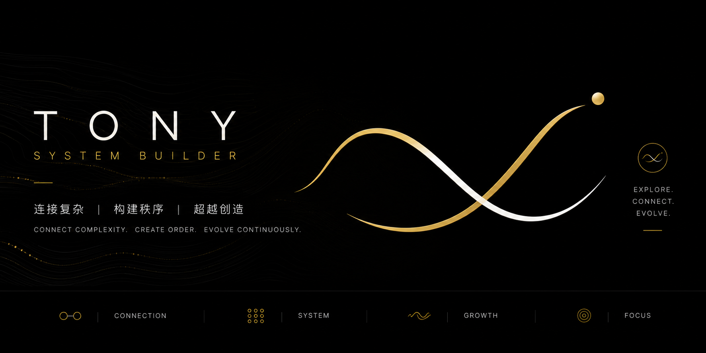

<div align="center">



<p>
  <a href="LICENSE"></a>
  <a href="https://github.com/YusenZhang0601/tutor/stargazers"></a>
  <a href="CONTRIBUTING.md"></a>
  <a href="#"></a>
  <a href="#learning-science"></a>
</p>

<h3>Stop pretending you learned. Start proving you mastered.</h3>

</div>

---

## 💡 The Problem

You use ChatGPT, Claude, or Copilot to learn something new. It explains clearly. You think "Got it!" and move on.

**Two days later?** Completely forgotten.

The issue isn't that AI isn't smart enough. The issue is:
- ❌ No **active recall** — you read answers, don't retrieve from memory
- ❌ No **spaced repetition** — you learn once, never review
- ❌ No **mastery validation** — "I understand" ≠ "I can explain it back"

**Learning isn't consuming information. It's proving you retained it.**

---

## ✨ The Solution

**Tutor** transforms any AI coding assistant into a personal learning coach that actually makes you master concepts.

Instead of this:
```
You: "Explain Python decorators"
AI: [Long explanation]
You: "Thanks!" [Never touches it again]
```

You get this:
```
Tutor: "Before I explain decorators, can you recall what a higher-order function is?"
You: [Struggles to remember]
Tutor: "Let's review that first. No skipping prerequisites."
[After solid review]
Tutor: "Now, explain decorators back to me in your own words."
You: [Feynman-style explanation]
Tutor: "Good. I'll quiz you on this in 6 days."
```

---

## 🆚 Why Tutor?

| Traditional Learning | AI Chatbot | 🎓 **Tutor** |
|---------------------|------------|----------|
| 📚 Read → "Done" | 💬 Ask → Get answer | 🔄 **Diagnose → Teach → Quiz → Review** |
| ❌ No retention tracking | ❌ No mastery validation | ✅ **SM-2 spaced repetition** |
| ❌ One-size-fits-all | ❌ Generic responses | ✅ **Personalized learning path** |
| ❌ "I think I know" | ❌ "Copy-paste knowledge" | ✅ **"I can explain it back"** (Feynman) |
| ❌ Rush through material | ❌ Direct answers | ✅ **Prerequisite gates** |
| ❌ Forget in days | ❌ Forget in hours | ✅ **Review reminders at optimal intervals** |

---

## 🚀 How It Works

```
   1️⃣ Onboard              2️⃣ Diagnose            3️⃣ Teach              4️⃣ Quiz
   ┌─────────────┐       ┌─────────────┐       ┌─────────────┐      ┌─────────────┐
   │ Build your  │   →   │ Find real   │   →   │ Fill ONLY   │  →   │ Active      │
   │ learning    │       │ gaps with   │       │ the gaps    │      │ recall +    │
   │ profile     │       │ questions   │       │ step by step│      │ Feynman test│
   └─────────────┘       └─────────────┘       └─────────────┘      └─────────────┘
                                                                              │
                        ┌──────────────────────────────────────────────────┘
                        ▼
   7️⃣ Evolve           6️⃣ Mastery Gate         5️⃣ Schedule Review
   ┌─────────────┐       ┌─────────────┐       ┌─────────────┐
   │ System      │   ←   │ Don't skip  │   ←   │ Spaced      │
   │ learns from │       │ weak        │       │ repetition  │
   │ mistakes    │       │ prerequisites│       │ (SM-2)      │
   └─────────────┘       └─────────────┘       └─────────────┘
```

**The 7-Step Mastery Loop**:
1. **Onboard** — Tell Tutor your goals, background, and learning pace
2. **Diagnose** — Socratic questioning finds your real starting point
3. **Teach** — Explains *only* what you're missing, not everything
4. **Quiz** — Forces active recall: "Explain it back to me"
5. **Schedule** — SM-2 algorithm schedules reviews at optimal intervals
6. **Gate** — Blocks new material if prerequisites aren't solid
7. **Evolve** — Tracks mistakes and adjusts teaching strategies

---

## 💬 See It In Action

### Session 1: Onboarding

```
You: Please read CLAUDE.md to initialize Tutor learning mode.

Tutor: I'm now in learning coach mode. Let's build your learner profile.
       What subject or skill do you want to master?

You: I want to learn Python for data analysis.

Tutor: Great goal. A few questions to personalize your path:
       1. What's your current Python level? (never coded / basics / intermediate)
       2. What's your background? (student / analyst / engineer / other)
       3. Time commitment? (hours per week)

You: Basics. I'm a business analyst. Maybe 3-4 hours per week.

Tutor: Perfect. I'll design a path that:
       - Builds on your analyst mindset (familiar contexts)
       - Focuses on pandas, visualization, real datasets
       - Fits 3-4 hours/week (2-3 concepts per session)
       
       ✓ Learner profile saved to .tutor/config/learner-profile.md
       
       Ready to start? Type: /plan Python
```

---

### Session 2: Diagnosis & Path Planning

```
You: /plan Python

Tutor: Before I design your path, let me diagnose your starting point.
       
       Quick check: Can you explain what a list comprehension does?

You: Hmm... it's a shortcut for loops?

Tutor: Close! Let me see where exactly you are...
       [asks 3-4 diagnostic questions]
       
       ✓ Diagnosis complete. Here's your personalized path:
       
       📚 Python for Data Analysis — Concept Map
       
       Foundation (Week 1-2):
         └─ Variables & Types → List operations → Dictionaries
                                      ↓
       Data Structures (Week 3-4):
         └─ List comprehensions → Pandas Series → DataFrames
                                                       ↓
       Analysis (Week 5-8):
         └─ Filtering data → Groupby → Joins → Visualization
       
       Prerequisites are mapped. I won't let you skip ahead with gaps.
       Ready to learn? Type: /learn
```

---

### Session 3: The Learning Loop

```
You: /learn

Tutor: Today's plan:
       • Review: 2 concepts due (from 6 days ago)
       • New: Learn list comprehensions
       
       ─────────────────────────────────────────
       📅 REVIEW: Dictionaries (learned 6 days ago)
       ─────────────────────────────────────────
       
       Before I show you anything, try to recall:
       How do you get a value from a dict if the key might not exist?

You: Use dict.get()?

Tutor: Exactly! And what does get() return if the key is missing?

You: Umm... None?

Tutor: Perfect. You've got this solid. ✓
       Quality: 5/5 (perfect recall)
       Next review: 15 days from now
       
       ─────────────────────────────────────────
       📚 NEW CONCEPT: List Comprehensions
       ─────────────────────────────────────────
       
       First, tell me: what do you already know about them?

You: They're... shorter ways to create lists?

Tutor: Good starting point. Let me build on that...
       [teaches concept step by step]
       
       Now, explain it back: How would you use a list comprehension
       to get all even numbers from [1,2,3,4,5,6]?

You: [x for x in [1,2,3,4,5,6] if x % 2 == 0]

Tutor: Perfect! You understand the syntax AND the logic. ✓
       Quality: 4/5 (correct, slight hesitation)
       
       I'll quiz you on this in 6 days.
       
       ─────────────────────────────────────────
       📊 SESSION SUMMARY
       ─────────────────────────────────────────
       Reviewed: 2 concepts (both solid ✓)
       Learned: 1 new concept (list comprehensions)
       Mastered: 0 → 2 concepts (dicts, loops promoted to mastered!)
       Next review: 2026-07-24 (2 concepts due)
```

---

### Session 4: Prerequisite Gate In Action

```
You: /learn

Tutor: Before we continue, let's review what's due today.
       
       📅 REVIEW: List Comprehensions (learned 6 days ago)
       
       Write a comprehension that filters names starting with 'A'
       from ['Alice', 'Bob', 'Anna', 'Charlie']

You: Um... [name for name in names if name[0] == 'A']?

Tutor: Correct logic, but you hesitated. Let's verify understanding.
       What if the list had empty strings? Would name[0] crash?

You: Oh... yeah, it would.

Tutor: Exactly. Let's review error handling...
       [reviews defensive programming]
       
       Quality: 3/5 (correct but shaky)
       
       ⚠️  MASTERY GATE ACTIVATED
       
       You planned to learn "Pandas DataFrames" today, but list
       comprehensions are still wobbly (need quality ≥4 to proceed).
       
       Let's do targeted practice on comprehensions first.
       [deliberate practice exercises]
       
       ✓ Now you're solid. Ready for DataFrames!
```

---

### Progress Visualization (Plain Text)

```
You: /status

Tutor: 📊 Learning Progress — Python for Data Analysis

       Mastery Overview:
       ████████████░░░░░░░░  12/20 concepts (60%)
       
       Status Breakdown:
       ✓ Mastered:    8 concepts (>21 day intervals, stable recall)
       ⚡ Learning:   4 concepts (active review cycle)
       📅 Scheduled:  4 concepts (due in next 7 days)
       🎯 Planned:    8 concepts (not started yet)
       
       Recent Performance:
       Last 7 days:  6 reviews, avg quality: 4.2/5
       Streak:       12 days consecutive practice
       
       Next Review:  2026-07-20 (2 concepts due)
       Weak Points:  Lambda functions (failed 2x), review scheduled
       
       Ready to: /learn (continue) | /review (catch up) | /test (quiz)
```

---

## 🎯 Real Learning Scenarios

### Example 1: Prerequisite Gate Saves You

```
You: /learn Python decorators
Tutor: Before we start, can you explain what a closure is?
You: Umm... not really
Tutor: No problem. Let's review closures first.
      [Teaches closures → Quiz → Pass]
Tutor: Now you're ready for decorators!
```

**Why this matters**: Without solid prerequisites, new concepts won't stick.

---

### Example 2: Spaced Repetition In Action

```
Day 1:  Learn concept A (mastery: 30%)
Day 2:  Quiz on A (quality: 4/5) → next review scheduled in 6 days
Day 8:  Active recall test (quality: 5/5) → interval extended to 15 days  
Day 23: Still remembers perfectly → marked as MASTERED ✓
```

**Why this matters**: Reviewing at the edge of forgetting = maximum retention with minimum time.

---

### Example 3: Feynman Validation Catches Illusion of Knowledge

```
You: I understand recursion now
Tutor: Great! Explain it back to me like I'm 10 years old
You: Well... it's when a function... calls itself... and...
Tutor: You're stuck on the concept, not just the syntax. Let's break it down differently.
```

**Why this matters**: "I understand" often means "I recognize it." True learning = explaining fluently.

---

## 🧠 Learning Science

Tutor is built on proven educational research:

<table>
<tr>
<td width="33%" align="center">

### 📊 2 Sigma Problem
**Bloom (1984)**

One-on-one tutoring beats classroom instruction by **2 standard deviations**.

Tutor automates this.

</td>
<td width="33%" align="center">

### 🧪 Testing Effect
**Roediger & Karpicke (2006)**

Retrieval practice (testing) produces **50% better retention** than re-reading.

Every quiz makes concepts stickier.

</td>
<td width="33%" align="center">

### 📅 Spacing Effect
**Ebbinghaus (1885)**

Spaced reviews beat cramming by **200%+** in long-term retention.

SM-2 algorithm schedules optimally.

</td>
</tr>
</table>

**Key principles**:
- **Active Recall** > Passive reading
- **Spaced Repetition** > Massed practice  
- **Feynman Technique** > Surface understanding
- **Mastery Gates** > Rushing ahead with weak foundations

---

## ⚡ Quick Start

### Step 1: Clone the repository

```bash
git clone https://github.com/YusenZhang0601/tutor.git
cd tutor
```

### Step 2: Open in your AI workspace

Works with:
- **Claude Code** (recommended)
- **Cursor**
- **GitHub Copilot**
- **OpenAI Codex**
- **Gemini CLI**
- Any agent that can read project instructions

### Step 3: Activate Tutor mode

Send this message to your AI agent:

```
Please read CLAUDE.md (or AGENTS.md) to initialize Tutor learning mode.
```

### Step 4: Start your first learning session

```
/onboard                    # Build your learner profile
/plan <subject>             # e.g., /plan Python
/learn                      # Start the mastery loop
```

**That's it!** Tutor handles the rest: diagnosis, teaching, quizzes, scheduling, gates.

---

## 📚 Usage Commands

| Command | What It Does |
|---------|-------------|
| `/onboard` | First-time interview: goals, background, pace, preferences |
| `/plan <subject>` | Diagnose your starting point, generate concept path |
| `/learn` | Full session: recall → teach → quiz → review → schedule |
| `/review` | Review today's due concepts only (no new material) |
| `/test <topic>` | Take a mastery quiz on a specific topic |
| `/status` | See your progress, mastery levels, review queue |
| `/evaluate` | Analyze learning effectiveness and bottlenecks |

**Example workflow**:

```bash
# Day 1
/onboard
/plan Machine Learning
/learn    # Learns 2-3 new concepts

# Day 2
/review   # Reviews yesterday's material
/learn    # Adds new concepts

# Day 8
/review   # Spaced repetition kicks in
/status   # Check what you've mastered
```

---

## 📁 Project Structure

```
.
├── AGENTS.md / CLAUDE.md          # Agent entry point (read this first)
├── .tutor/
│   ├── config/
│   │   ├── learner-profile.md     # Your personalized profile
│   │   └── project.yml            # System configuration
│   ├── core/
│   │   ├── protocol.md            # Session workflow & command mapping
│   │   ├── settings.yml           # Mastery thresholds & SM-2 parameters
│   │   ├── scripts/               # Validation & maintenance scripts
│   │   └── skills/                # 9 learning skills (onboard, teach, quiz...)
│   ├── data/
│   │   └── review-cards.json      # Quiz templates for each concept
│   └── docs/                      # Session checklists & upgrade notes
├── state/
│   ├── mastery.json               # Concept mastery states & progress
│   ├── reviews.jsonl              # Review history (SM-2 log)
│   ├── due.md                     # Today's review queue
│   └── mistakes.md                # Error tracking for targeted practice
├── subjects/                      # Your learning content
│   └── <subject>/
│       ├── INDEX.md               # Subject overview & concept graph
│       ├── topics/                # Organized by topics
│       └── progress.md            # Session-by-session learning log
└── examples/                      # Example subject structures
```

**Key concepts**:
- **State lives in files** (not databases) so the AI can read/write directly
- **Concept notes have frontmatter** with SM-2 state (ef, interval, reps, due)
- **Protocol is explicit** so the agent stays disciplined

---

## 🛠️ Advanced Features

### 1. SM-2 Spaced Repetition Algorithm

Every concept tracks:
- `ef` (easiness factor) — how hard it is for you
- `interval` — days until next review
- `reps` — successful review count
- `due` — next review date

Quality ratings (0-5) adjust scheduling:
- **5** = Perfect recall → long interval
- **3-4** = Correct but slow → moderate interval
- **<3** = Forgot → reset to 1 day

### 2. Mastery Gates

A concept is **mastered** only when:
- ✅ Reviewed successfully ≥3 times (configurable)
- ✅ Interval extended to ≥21 days
- ✅ Quality rating ≥4 in recent quizzes

Until prerequisites are mastered, new material is blocked.

### 3. Mistake Tracking

Wrong answers aren't lost — they go to `state/mistakes.md`:
- Tutor biases future quizzes toward your weak points
- Explanations are adjusted based on your error patterns
- Deliberate practice targets specific gaps

### 4. Self-Evolution

The system learns from:
- User corrections ("That explanation didn't work for me")
- Repeated mistakes (concept needs a different approach)
- Session data (pacing, difficulty calibration)

Changes are proposed, not auto-applied (you stay in control).

---

## 🤝 Contributing

We welcome contributions! Areas where you can help:

- 📸 **Screenshots & demos** — Show Tutor in action
- 🎨 **Visual design** — Banner, badges, diagrams
- 📝 **Subject templates** — Add example learning paths (Python, React, Stats...)
- 🐛 **Bug reports** — Found an issue? Open an issue
- 🚀 **Feature ideas** — Suggest improvements in Discussions
- 📖 **Documentation** — Improve explanations, add FAQs

See [CONTRIBUTING.md](CONTRIBUTING.md) for guidelines.

---

## 🗺️ Roadmap

### v1.0 (Current)
- ✅ Core mastery learning loop
- ✅ SM-2 spaced repetition
- ✅ 9 learning skills
- ✅ File-based state management
- ✅ Multi-agent support (Claude, GPT, Gemini)

### v1.1 (Next)
- [ ] Web dashboard for progress visualization
- [ ] Export to Anki/Obsidian
- [ ] Community skill templates
- [ ] Mobile app support

### v2.0 (Future)
- [ ] FSRS v5 algorithm (better than SM-2)
- [ ] Collaborative learning (study groups)
- [ ] LLM-as-Judge for automated grading
- [ ] Integration with note-taking tools

---

## 💬 Community & Support

- **GitHub Discussions**: [Ask questions, share learning paths](https://github.com/YusenZhang0601/tutor/discussions)
- **Issues**: [Report bugs, request features](https://github.com/YusenZhang0601/tutor/issues)
- **Twitter/X**: [@YusenZhang0601](https://twitter.com/YusenZhang0601) — updates & learning science tips

---

## 📄 License

[MIT License](LICENSE) — Free to use, modify, and distribute.

---

## 🙏 Acknowledgments

Tutor stands on the shoulders of giants:

- **Benjamin Bloom** — 2 Sigma Problem (1984)
- **Richard Feynman** — Feynman Learning Technique  
- **Hermann Ebbinghaus** — Spacing Effect research
- **Piotr Woźniak** — SuperMemo & SM-2 algorithm
- **Andy Matuschak** — Evergreen notes & spaced repetition systems

Special thanks to **Hu Lao Shi** for introducing me to the Feynman technique, which inspired this entire project.

---

## 🌟 Star History

<!-- TODO: Add star history chart after getting some stars -->
<!-- Use https://star-history.com/ -->

---

<div align="center">

**Made with ❤️ by [TonyRainforest](https://github.com/YusenZhang0601)**

*If Tutor helped you truly master something, [give it a star ⭐](https://github.com/YusenZhang0601/tutor)*

</div>
